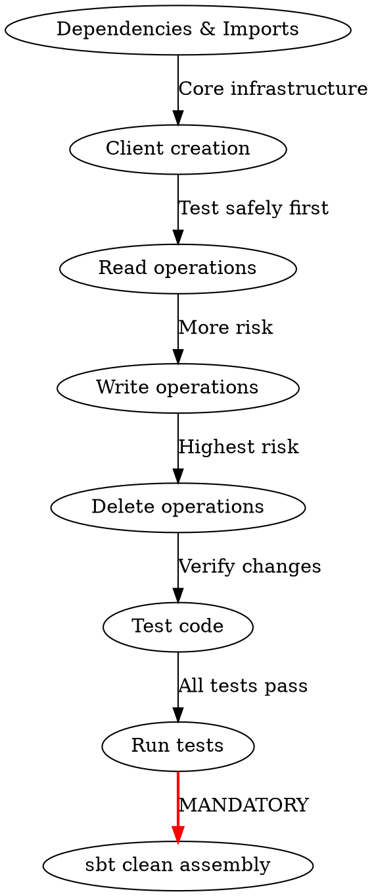

# AWS SDK v1 to v2 Migration

## Overview

Systematic migration from AWS SDK v1 to v2 for Scala/Java projects. Covers dependencies, imports, client builders, API operations, and test code.

**Core principle:** Pattern-based transformation with internal plugin support (RecsPlugin).

## When to Use

**Use when:**
- Project uses `com.amazonaws` packages
- Build file has `aws-java-sdk-*` dependencies
- Migrating S3, DynamoDB, SQS, SNS, or other AWS services
- Using internal build plugins (RecsPlugin, custom plugins)
- Need to update both main and test code

**Don't use for:**
- AWS SDK v2 to v3 migrations
- Projects already on SDK v2
- CDK or CloudFormation (different tooling)

## Migration Phases


## Quick Reference

| Component | v1 | v2 |
|-----------|----|----|
| **Package** | `com.amazonaws` | `software.amazon.awssdk` |
| **S3 Client** | `AmazonS3` | `S3Client` |
| **S3 Builder** | `AmazonS3ClientBuilder` | `S3Client.builder()` |
| **Exception** | `AmazonS3Exception` | `S3Exception` |
| **Credentials** | `BasicAWSCredentials` | `AwsBasicCredentials` |
| **API Style** | Positional params | Builder pattern |
| **List Pagination** | `listNextBatch` | `continuationToken` |

## Phase 1: Audit Current v1 Usage

### Find All AWS SDK v1 References

```bash
# Find imports
grep -r "import com.amazonaws" --include="*.scala" --include="*.java" .

# Find model usage
grep -r "AmazonS3\|S3Client\|DynamoDB\|SQS" --include="*.scala" .

# Check dependencies
grep -E "aws-java-sdk|awscala" build.sbt pom.xml
```

### Document Patterns

Create `.claude/aws-sdk-migration-patterns.md` with:
- Current dependencies and versions
- All AWS services used
- Client creation patterns
- API operations used
- Test setup patterns
- Custom wrappers or abstractions

## Phase 2: Update Dependencies

### With RecsPlugin (Required for Elsevier Projects)

**project/plugins.sbt:**
```scala
// Update to 2.1.3 which provides AWS SDK v2 support
addSbtPlugin("com.elsevier.recs" %% "recs-build" % "2.1.3")
```

**build.sbt:**
```scala
// Before
val awsSdkVersion = RecsPlugin.awsSDKVersion  // v1 version

libraryDependencies ++= RecsPlugin.jacksonDependencies ++
  Seq(
    "com.amazonaws" % "aws-java-sdk-s3" % awsSdkVersion,
    "com.amazonaws" % "aws-java-sdk-dynamodb" % awsSdkVersion,
    "com.github.seratch" %% "awscala" % "0.8.5",  // REMOVE - not compatible with v2
  )
```

```scala
// After - RecsPlugin 2.1.3 provides v2 versions
val awsSdkVersion = RecsPlugin.awsSDKVersion  // v2 version from RecsPlugin

libraryDependencies ++= RecsPlugin.jacksonDependencies ++
  Seq(
    "software.amazon.awssdk" % "s3" % awsSdkVersion,
    "software.amazon.awssdk" % "dynamodb" % awsSdkVersion,
    // awscala removed - not used in code
  )
```

**CRITICAL:** Always use RecsPlugin 2.1.3 for AWS SDK v2 version management. Do not hardcode versions.

### Without RecsPlugin

```scala
// Explicit v2 versions
val awsSdkVersion = "2.29.26"  // Or latest

libraryDependencies ++= Seq(
  "software.amazon.awssdk" % "s3" % awsSdkVersion,
  "software.amazon.awssdk" % "dynamodb" % awsSdkVersion,
  // Add other services as needed
)
```

### Critical Dependency Changes

**MUST REMOVE:**
```scala
"com.github.seratch" %% "awscala" % "0.8.5"  // Not compatible with v2, never used in code
```

**Why remove awscala:**
- Not compatible with AWS SDK v2
- Typically not actually used in code (check imports first)
- If found in code, refactor to use SDK directly

## Phase 3: Update Imports

### Global Import Changes

**Search and replace across codebase:**

| v1 Import | v2 Import |
|-----------|-----------|
| `com.amazonaws.services.s3.AmazonS3` | `software.amazon.awssdk.services.s3.S3Client` |
| `com.amazonaws.services.s3.AmazonS3ClientBuilder` | `software.amazon.awssdk.services.s3.S3Client` |
| `com.amazonaws.services.s3.model._` | `software.amazon.awssdk.services.s3.model._` |
| `com.amazonaws.services.s3.model.AmazonS3Exception` | `software.amazon.awssdk.services.s3.model.S3Exception` |
| `com.amazonaws.auth.BasicAWSCredentials` | `software.amazon.awssdk.auth.credentials.AwsBasicCredentials` |
| `com.amazonaws.auth.AWSStaticCredentialsProvider` | `software.amazon.awssdk.auth.credentials.StaticCredentialsProvider` |
| `com.amazonaws.client.builder.AwsClientBuilder` | `software.amazon.awssdk.regions.Region` + `java.net.URI` |

### Additional Imports Needed

```scala
// For v2 operations
import software.amazon.awssdk.core.sync.RequestBody
import software.amazon.awssdk.core.sync.ResponseTransformer
import software.amazon.awssdk.regions.Region
import java.net.URI
```

## Phase 4: Update Client Creation

### Default Client

**v1:**
```scala
lazy val amazonS3 = AmazonS3ClientBuilder.defaultClient()
```

**v2 (REQUIRED PATTERN - Fail if AWS_REGION not set):**
```scala
lazy val amazonS3 = S3Client.builder()
  .region(Region.of(
    sys.env.getOrElse("AWS_REGION",
      throw new IllegalStateException(
        "AWS_REGION environment variable must be set"
      )
    )
  ))
  .build()
```

**Why this pattern:**
- Explicit configuration required (no hidden defaults)
- Fails fast if misconfigured
- Works in AWS environments (ECS, Lambda, EC2)
- Clear error message on startup

**Alternative with custom region method:**
```scala
private def requiredRegion(): Region = {
  Region.of(
    sys.env.getOrElse("AWS_REGION",
      throw new IllegalStateException(
        "AWS_REGION environment variable is required. " +
        "Set it to your AWS region (e.g., us-east-1, eu-west-1)"
      )
    )
  )
}

lazy val amazonS3 = S3Client.builder()
  .region(requiredRegion())
  .build()
```

### LocalStack Test Client

**v1:**
```scala
def createLocalStackS3(): AmazonS3 = {
  AmazonS3ClientBuilder.standard()
    .withEndpointConfiguration(
      new AwsClientBuilder.EndpointConfiguration(
        "http://localhost:4566",
        "us-east-1"
      )
    )
    .withCredentials(
      new AWSStaticCredentialsProvider(
        new BasicAWSCredentials("test", "test")
      )
    )
    .withPathStyleAccessEnabled(true)
    .build()
}
```

**v2:**
```scala
def createLocalStackS3(): S3Client = {
  S3Client.builder()
    .endpointOverride(URI.create("http://localhost:4566"))
    .region(Region.US_EAST_1)
    .credentialsProvider(
      StaticCredentialsProvider.create(
        AwsBasicCredentials.create("test", "test")
      )
    )
    .forcePathStyle(true)
    .build()
}
```

### Custom Client with Credentials

**v2:**
```scala
S3Client.builder()
  .region(requiredRegion())  // Use helper method from above
  .credentialsProvider(DefaultCredentialsProvider.create())
  .build()
```

### Region Configuration Summary

**ALWAYS use this pattern:**
```scala
private def requiredRegion(): Region = {
  Region.of(
    sys.env.getOrElse("AWS_REGION",
      throw new IllegalStateException("AWS_REGION environment variable is required")
    )
  )
}
```

**DO NOT:**
- ❌ Hardcode regions: `.region(Region.US_EAST_1)`
- ❌ Use fallback defaults: `.getOrElse("AWS_REGION", "us-east-1")`
- ❌ Skip region configuration (will fail at runtime)

**LocalStack exception:** Tests can use `Region.US_EAST_1` since it's test infrastructure

## Phase 5: Migrate S3 Operations

### PUT Object (String Content)

**v1:**
```scala
def put(bucket: String, key: String, content: String): PutObjectResult = {
  s3Client.putObject(bucket, key, content)
}
```

**v2:**
```scala
def put(bucket: String, key: String, content: String): PutObjectResponse = {
  s3Client.putObject(
    PutObjectRequest.builder()
      .bucket(bucket)
      .key(key)
      .build(),
    RequestBody.fromString(content)
  )
}
```

### PUT Object with Encryption (AES-256)

**v1:**
```scala
def putEncrypted(bucket: String, key: String, content: String): PutObjectResult = {
  val metadata = new ObjectMetadata()
  metadata.setContentLength(content.getBytes("UTF-8").length)
  metadata.setSSEAlgorithm(ObjectMetadata.AES_256_SERVER_SIDE_ENCRYPTION)

  s3Client.putObject(
    bucket,
    key,
    IOUtils.toInputStream(content, StandardCharsets.UTF_8),
    metadata
  )
}
```

**v2:**
```scala
def putEncrypted(bucket: String, key: String, content: String): PutObjectResponse = {
  s3Client.putObject(
    PutObjectRequest.builder()
      .bucket(bucket)
      .key(key)
      .serverSideEncryption(ServerSideEncryption.AES256)
      .build(),
    RequestBody.fromString(content)
  )
}
```

**Note:** v2 automatically handles content length.

### DELETE Object

**v1:**
```scala
def delete(bucket: String, key: String): Unit = {
  s3Client.deleteObject(bucket, key)
}
```

**v2:**
```scala
def delete(bucket: String, key: String): DeleteObjectResponse = {
  s3Client.deleteObject(
    DeleteObjectRequest.builder()
      .bucket(bucket)
      .key(key)
      .build()
  )
}
```

### LIST Objects with Pagination

**v1:**
```scala
def listObjects(bucket: String, prefix: String): Seq[String] = {
  import scala.collection.JavaConverters._
  val results = scala.collection.mutable.ArrayBuffer[String]()

  var listing = s3Client.listObjects(bucket, prefix)
  results ++= listing.getObjectSummaries.asScala.map(_.getKey)

  while (listing.isTruncated) {
    listing = s3Client.listNextBatchOfObjects(listing)
    results ++= listing.getObjectSummaries.asScala.map(_.getKey)
  }

  results.toSeq
}
```

**v2:**
```scala
def listObjects(bucket: String, prefix: String): Seq[String] = {
  import scala.collection.JavaConverters._
  val results = scala.collection.mutable.ArrayBuffer[String]()

  val request = ListObjectsV2Request.builder()
    .bucket(bucket)
    .prefix(prefix)
    .build()

  var response = s3Client.listObjectsV2(request)
  results ++= response.contents().asScala.map(_.key())

  while (response.isTruncated) {
    response = s3Client.listObjectsV2(
      request.copy(_.continuationToken(response.nextContinuationToken()))
    )
    results ++= response.contents().asScala.map(_.key())
  }

  results.toSeq
}
```

**Key changes:**
- Use `listObjectsV2` (recommended over `listObjects`)
- Pagination uses `continuationToken` instead of `listNextBatch`
- Model getters are now methods: `getKey()` → `key()`

### LIST with Delimiter (Common Prefixes)

**v1:**
```scala
val request = new ListObjectsRequest()
  .withBucketName(bucket)
  .withPrefix(prefix)
  .withDelimiter("/")

var listing = s3Client.listObjects(request)
val prefixes = listing.getCommonPrefixes.asScala
```

**v2:**
```scala
val request = ListObjectsV2Request.builder()
  .bucket(bucket)
  .prefix(prefix)
  .delimiter("/")
  .build()

var response = s3Client.listObjectsV2(request)
val prefixes = response.commonPrefixes().asScala.map(_.prefix())
```

### GET Object (Read as String)

**v1:**
```scala
def readKey(bucket: String, key: String): String = {
  val s3Object = s3Client.getObject(bucket, key)
  val stream = s3Object.getObjectContent
  try {
    Source.fromInputStream(stream).mkString
  } finally {
    stream.close()
  }
}
```

**v2:**
```scala
def readKey(bucket: String, key: String): String = {
  val response = s3Client.getObject(
    GetObjectRequest.builder()
      .bucket(bucket)
      .key(key)
      .build()
  )

  try {
    new String(response.readAllBytes(), StandardCharsets.UTF_8)
  } finally {
    response.close()
  }
}
```

### GET Object to File

**v2:**
```scala
s3Client.getObject(
  GetObjectRequest.builder()
    .bucket(bucket)
    .key(key)
    .build(),
  ResponseTransformer.toFile(Paths.get("/path/to/file"))
)
```

## Phase 6: Update Model Classes

### Wrapper Objects

**v1:**
```scala
case class S3ObjectWrapper(summary: S3ObjectSummary) {
  def size(): Long = summary.getSize
  def key(): String = summary.getKey
}
```

**v2:**
```scala
case class S3ObjectWrapper(s3Object: S3Object) {
  def size(): Long = s3Object.size()
  def key(): String = s3Object.key()
}
```

**Key changes:**
- `S3ObjectSummary` → `S3Object` (in ListObjectsV2Response)
- Getters are now methods: `getSize()` → `size()`

## Phase 7: Update Exception Handling

**v1:**
```scala
import com.amazonaws.services.s3.model.AmazonS3Exception

try {
  s3Client.createBucket(bucket)
} catch {
  case e: AmazonS3Exception if e.getStatusCode == 409 =>
    // Bucket already exists
  case e: AmazonS3Exception =>
    logger.error(s"S3 error: ${e.getErrorCode}")
}
```

**v2:**
```scala
import software.amazon.awssdk.services.s3.model.S3Exception

try {
  s3Client.createBucket(CreateBucketRequest.builder()
    .bucket(bucket)
    .build())
} catch {
  case e: S3Exception if e.statusCode() == 409 =>
    // Bucket already exists
  case e: S3Exception =>
    logger.error(s"S3 error: ${e.awsErrorDetails().errorCode()}")
}
```

**Key changes:**
- `AmazonS3Exception` → `S3Exception`
- `getStatusCode()` → `statusCode()`
- `getErrorCode()` → `awsErrorDetails().errorCode()`

## Phase 8: Update Tests

### Mockito Static Mocking

**Challenge:** v2 uses builder pattern which is harder to mock.

**v1 pattern:**
```scala
val mocked = mockStatic(classOf[AmazonS3ClientBuilder])
mocked.when(() => AmazonS3ClientBuilder.defaultClient())
  .thenReturn(mockS3)
```

**v2 approach - Mock the client directly:**
```scala
// Instead of mocking builder, inject test client via trait
trait TestS3Client {
  lazy val s3Client: S3Client = createTestS3Client()

  private def createTestS3Client(): S3Client = {
    S3Client.builder()
      .endpointOverride(URI.create("http://localhost:4566"))
      .region(Region.US_EAST_1)
      .forcePathStyle(true)
      .build()
  }
}
```

### Test Trait Pattern

**v1:**
```scala
trait LazyS3Client {
  lazy val amazonS3 = AmazonS3ClientBuilder.defaultClient()
}
```

**v2:**
```scala
trait LazyS3Client {
  lazy val amazonS3: S3Client = S3Client.builder()
    .region(Region.US_EAST_1)
    .build()
}

trait TestS3Client extends LazyS3Client {
  override lazy val amazonS3: S3Client = S3Client.builder()
    .endpointOverride(URI.create("http://localhost:4566"))
    .region(Region.US_EAST_1)
    .credentialsProvider(
      StaticCredentialsProvider.create(
        AwsBasicCredentials.create("test", "test")
      )
    )
    .forcePathStyle(true)
    .build()
}
```

### Update Test Assertions

**v1:**
```scala
result shouldBe a[PutObjectResult]
listing.getObjectSummaries should have size 5
```

**v2:**
```scala
result shouldBe a[PutObjectResponse]
response.contents() should have size 5
```

## Phase 9: Handle Class Name Conflicts

**Problem:** Your custom `S3Client` wrapper conflicts with v2's `S3Client`.

**Solution 1 - Rename wrapper:**
```scala
// Before
class S3Client(amazonS3: AmazonS3)

// After
class S3ClientWrapper(s3Client: S3Client)
```

**Solution 2 - Use qualified imports:**
```scala
import software.amazon.awssdk.services.{s3 => awsS3}

class S3Client(s3: awsS3.S3Client)
```

**Solution 3 - Package-private scope:**
```scala
package com.company.io.s3.internal

private[s3] class S3Client(s3: software.amazon.awssdk.services.s3.S3Client)
```

## Phase 10: Update Build Configuration

### Assembly Merge Strategy

If you have custom merge strategies for v1:

```scala
// v1
assembly / assemblyMergeStrategy := {
  case PathList("com", "amazonaws", xs @ _*) =>
    MergeStrategy.first
  case x => oldStrategy(x)
}
```

```scala
// v2
assembly / assemblyMergeStrategy := {
  case PathList("software", "amazon", "awssdk", xs @ _*) =>
    MergeStrategy.first
  case x => oldStrategy(x)
}
```

## Phase 11: Assembly Verification (CRITICAL)

### Verify Clean Assembly

**REQUIRED:** After all code changes, verify the project assembles successfully:

```bash
sbt clean assembly
```

**Why this matters:**
- Catches dependency conflicts
- Verifies no v1/v2 mixing
- Ensures merge strategies work
- Validates transitive dependencies

### Troubleshooting Assembly Failures

#### Error: "deduplicate: different file contents found"

**Symptom:**
```
[error] deduplicate: different file contents found in the following:
[error] com/amazonaws/...
[error] software/amazon/awssdk/...
```

**Cause:** Both v1 and v2 dependencies present (transitive dependency issue)

**Fix:**
```bash
# Find which dependencies pull in v1
sbt dependencyTree | grep "com.amazonaws"

# Exclude v1 from transitive dependencies
libraryDependencies ++= Seq(
  "com.some.library" %% "library-name" % "1.0" exclude("com.amazonaws", "aws-java-sdk-core")
)
```

#### Error: Class conflicts between internal and external S3Client

**Symptom:**
```
[error] Multiple files with same path: com/elsevier/recs/io/s3/internal/S3Client.class
```

**Cause:** Internal library and this project both have custom S3Client wrappers

**Fix:** Use merge strategy (see Phase 10) or rename your wrapper:
```scala
assembly / assemblyMergeStrategy := {
  case PathList("com", "elsevier", "recs", "io", "s3", "internal", xs @ _*) =>
    MergeStrategy.first  // Use local version
  case x => oldStrategy(x)
}
```

#### Error: Missing region provider

**Symptom:**
```
Exception in thread "main" software.amazon.awssdk.core.exception.SdkClientException:
Unable to load region from any of the providers in the chain
```

**Cause:** AWS_REGION not set at runtime

**Fix:** This is EXPECTED - the error proves fail-fast works. Set AWS_REGION in deployment:
```bash
export AWS_REGION=us-east-1
sbt assembly
```

#### Error: Module collision with Jackson

**Symptom:**
```
[error] Modules were resolved with conflicting cross-version suffixes:
[error]    com.fasterxml.jackson.core:jackson-databind
```

**Fix:** Let RecsPlugin manage Jackson versions:
```scala
// Remove explicit Jackson dependencies
// RecsPlugin.jacksonDependencies handles all Jackson deps
libraryDependencies ++= RecsPlugin.jacksonDependencies
```

### Assembly Verification Checklist

Run these commands in order:

```bash
# 1. Clean everything
sbt clean

# 2. Check for dependency conflicts
sbt evicted

# 3. Look for v1 dependencies (should find NONE)
sbt dependencyTree | grep "com.amazonaws"

# 4. Verify v2 dependencies present
sbt dependencyTree | grep "software.amazon.awssdk"

# 5. Attempt assembly
sbt assembly

# 6. Verify assembly artifact
ls -lh target/scala-*/your-project-assembly-*.jar
```

**Success criteria:**
- `sbt assembly` completes without errors
- No v1 dependencies in `dependencyTree`
- Assembly JAR file created in `target/`
- File size reasonable (not doubled due to v1+v2)

## Other AWS Services

### DynamoDB

**Client creation:**
```scala
// v2
DynamoDbClient.builder()
  .region(Region.US_EAST_1)
  .build()
```

**Operations use same builder pattern:**
```scala
client.putItem(
  PutItemRequest.builder()
    .tableName("MyTable")
    .item(Map("id" -> AttributeValue.builder().s("123").build()).asJava)
    .build()
)
```

### SQS

**Client creation:**
```scala
// v2
SqsClient.builder()
  .region(Region.US_EAST_1)
  .build()
```

**Send message:**
```scala
client.sendMessage(
  SendMessageRequest.builder()
    .queueUrl(queueUrl)
    .messageBody(body)
    .build()
)
```

### SNS

**Client creation:**
```scala
// v2
SnsClient.builder()
  .region(Region.US_EAST_1)
  .build()
```

## Common Mistakes

| Mistake | Fix |
|---------|-----|
| **Skipping `sbt clean assembly` verification** | **ALWAYS run assembly before considering migration complete** |
| Tests pass but assembly fails | v1 and v2 both present - check `sbt dependencyTree` |
| Hardcoding region or using fallback default | Use `requiredRegion()` helper that fails if AWS_REGION not set |
| Forgetting region in v2 | Always specify `.region()` in builder |
| Using `listObjects` instead of `listObjectsV2` | Use `listObjectsV2` (recommended) |
| Not handling pagination correctly | Use `continuationToken`, not `listNextBatch` |
| Expecting automatic string → body conversion | Use `RequestBody.fromString()` |
| Using v1 getter style (`getKey()`) | Use v2 method style (`key()`) |
| Not closing response streams | Use try-finally or try-with-resources |
| Mixing v1 and v2 dependencies | Remove all v1 deps, verify with `sbt dependencyTree` |
| Keeping awscala dependency | Remove completely - not compatible with v2 |
| Transitive dependencies pulling in v1 | Use `exclude()` on dependencies that pull v1 |
| Forgetting `forcePathStyle` for LocalStack | Required for LocalStack/MinIO compatibility |
| Not updating RecsPlugin to 2.1.3 | Plugin version must be 2.1.3 for v2 support |
| Assuming "tests pass" = "migration done" | Must verify assembly succeeds - it catches different issues |

## Verification Checklist

### Build Configuration
- [ ] RecsPlugin updated to version 2.1.3 in `project/plugins.sbt`
- [ ] awscala dependency completely removed from build.sbt
- [ ] All v1 dependencies removed (`com.amazonaws:aws-java-sdk-*`)
- [ ] All v2 dependencies added (`software.amazon.awssdk:*`)
- [ ] Build file dependencies updated (verify with `sbt dependencyTree`)

### Code Changes
- [ ] All `com.amazonaws` imports replaced with `software.amazon.awssdk`
- [ ] Region configuration uses `requiredRegion()` pattern (fails if AWS_REGION not set)
- [ ] All client builders updated to v2 style
- [ ] All API operations using builder pattern
- [ ] Pagination using continuation tokens (not `listNextBatch`)
- [ ] Exception handling uses v2 exceptions (`S3Exception` not `AmazonS3Exception`)
- [ ] Model method calls updated (`getKey()` → `key()`, `getSize()` → `size()`)
- [ ] No class name conflicts with v2 `S3Client`

### Test Updates
- [ ] Test setup updated (LocalStack uses `Region.US_EAST_1`)
- [ ] Mockito static mocking updated or replaced with dependency injection
- [ ] Unit tests passing
- [ ] Integration tests passing

### Assembly Verification (CRITICAL - DO NOT SKIP)
- [ ] `sbt clean` completes
- [ ] `sbt evicted` shows no major conflicts
- [ ] `sbt dependencyTree | grep "com.amazonaws"` returns NOTHING (no v1 deps)
- [ ] `sbt dependencyTree | grep "software.amazon.awssdk"` shows v2 deps
- [ ] **`sbt clean assembly` completes successfully** ✓
- [ ] Assembly JAR created in `target/scala-*/`
- [ ] JAR size is reasonable (not doubled due to v1+v2 both present)

### Runtime Verification
- [ ] No runtime warnings about deprecated APIs
- [ ] Verified AWS_REGION environment variable is set in deployment environments
- [ ] Application starts successfully with v2 SDK

## Migration Order



**Start with:**
1. Update RecsPlugin to 2.1.3
2. Update dependencies (remove awscala, update to v2)
3. Fix all imports
4. Update client creation
5. Read operations (GET, LIST)

**Then:**
6. Write operations (PUT)
7. Delete operations
8. Exception handling

**Finally:**
9. Test code updates
10. Full test suite run
11. **`sbt clean assembly` (MANDATORY)**

**Why this order:**
- Minimizes blast radius
- Read operations are safest to test first
- Assembly verification catches dependency issues before deployment

## Internal Dependencies

**If project depends on internal libraries (e.g., `recs-validation`):**

1. **Check dependency version:**
   ```scala
   "com.elsevier.recs" %% "recs-validation" % "2.0.1"
   ```

2. **Coordinate with library owners:**
   - Does library provide v2 compatibility?
   - What version has v2 support?
   - Are breaking changes expected?

3. **Migration options:**
   - **Option A:** Library already migrated → update version
   - **Option B:** Migrate library first → then this project
   - **Option C:** Coordinate parallel migration

4. **Assembly conflicts:**
   If library includes v1 classes, use merge strategy:
   ```scala
   assembly / assemblyMergeStrategy := {
     case PathList("com", "elsevier", "recs", "io", "s3", xs @ _*) =>
       MergeStrategy.first  // Use local version
     case x => oldStrategy(x)
   }
   ```

## Definition of Done

**Migration is NOT complete until ALL of these pass:**

```bash
# 1. All tests pass
sbt test

# 2. All integration tests pass
sbt it:test

# 3. No v1 dependencies remain
sbt dependencyTree | grep "com.amazonaws"  # Should return NOTHING

# 4. Assembly succeeds (MANDATORY)
sbt clean assembly  # Must complete successfully

# 5. Assembly artifact exists
ls -lh target/scala-*/your-project-assembly-*.jar  # File should exist
```

**DO NOT consider migration complete if:**
- ❌ Tests pass but haven't run `sbt clean assembly`
- ❌ Assembly works locally but haven't verified AWS_REGION in deployment
- ❌ Code compiles but integration tests fail
- ❌ Any `com.amazonaws` imports remain

**Migration is complete ONLY when:**
- ✅ All code uses `software.amazon.awssdk`
- ✅ All tests pass (unit + integration)
- ✅ `sbt clean assembly` succeeds
- ✅ No v1 dependencies in `dependencyTree`
- ✅ AWS_REGION configured in deployment environments

## Real-World Impact

**Typical project (7 S3 operations, 2000 LOC):**
- Migration time: 4-6 hours
- Files changed: 8-12 files
- Test updates: Required
- Runtime behavior: Identical (if done correctly)

**Benefits:**
- Security updates from AWS
- Better performance (v2 is optimized)
- Modern async support (if needed)
- Continued AWS support

**Common time sinks:**
- Assembly issues due to transitive dependencies (1-2 hours)
- Test setup for LocalStack (30 min - 1 hour)
- Finding all usages in large codebase (1-2 hours)
